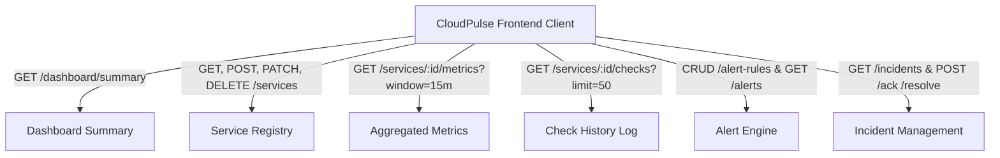
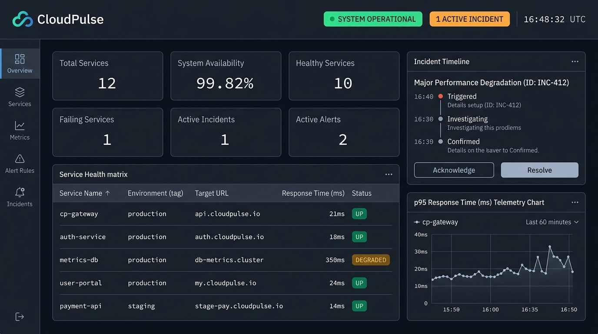
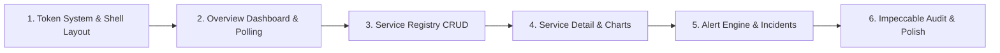

# CloudPulse Phase 2 — Design Discovery & Design-System Proposal (Revised)

**Target Identity:** Hybrid Intelligence Terminal + Modern Observability Platform  
**Target Surface Mode:** `Operate` (Telemetry, Mission-Critical Monitoring, Active Incident Management)  
**Status:** Design Discovery & Specification Phase (No application code modified)

---

## 1. Design Skills Inspection & Reconciliation

### 1.1 Skills Inspected
- **TasteSkill (`design-taste-frontend`):** [SKILL.md](file:///C:/Users/tmtec/.agents/skills/design-taste-frontend/SKILL.md)  
  *Directives applied:* Brief inference ("Design Read"), Dial configuration, Anti-default discipline (banning generic AI purple mesh gradients, floating bubbles, bloated cards, and repetitive 3-column templates), dark mode token architecture, and authentic data representation.
- **Impeccable (`impeccable`):** [SKILL.md](file:///C:/Users/tmtec/.agents/skills/impeccable/SKILL.md) and [reference/operate.md](file:///C:/Users/tmtec/.agents/skills/impeccable/reference/operate.md)  
  *Directives applied:* `Operate` mode depth (task-first, high scanability, earned familiarity, tool disappearing into the task, purposeful state-driven motion, and eliminating decorative animations or display fonts in UI labels).
- **`awesome design.md` Check:** Verified local workspace and agent directories. No file named `awesome design.md` exists on disk; no undocumented rules were assumed.

### 1.2 Overlap, Conflicts & Resolution
| Domain | TasteSkill (`design-taste-frontend`) | Impeccable (`impeccable`) | Resolution for CloudPulse Phase 2 |
| :--- | :--- | :--- | :--- |
| **Surface Focus** | Targeted toward landing pages, portfolios, marketing | Targeted toward product UIs, dashboards, tools (`Operate`) | **Impeccable's `Operate` mode takes structural precedence** for layout, component affordances, tables, and operational workflows. |
| **Aesthetic Guardrails** | High variance, expressive layout, strict anti-AI tells | Restrained, familiar affordances, consistent components | **TasteSkill takes precedence for anti-slop rules**: bans generic AI mesh, enforces color calibration, dark mode token strategy, and authentic typography. |
| **Motion Guidelines** | Recommends kinetic/physics motion (intensity 1–10) | Strictly limits motion to 150–250ms state changes | **Reconciled Expressive Operational Motion:** Micro-interactions remain snappy (150ms), while meaningful data events (metric window shifts, incident lifecycle state changes, drawer reveals) utilize expressive, physics-informed spring/ease transitions (250–350ms). Zero continuous looping decorative animations. |
| **Visual Density** | Default presets range from 3 (airy) to 5 (service) | Permits high density for tables and tools | **Calibrated Balanced Operational Density:** Re-calibrated from an extreme cockpit setting (8) to a balanced operational density (`5–6`), ensuring generous 44–48px table targets, readable typography, and clean breathing room. |

---

## 2. Verified Backend Contracts & Data Boundaries

The frontend will bind strictly to verified Phase 1 endpoints. We explicitly distinguish between **verified backend contracts** and **client-derived or currently unavailable data**.



### 2.1 Backend Contract Audit

| Endpoint & Method | Supported Query Parameters | Exact Verified Response Payload Fields | Data Classification & Truthful Capability |
| :--- | :--- | :--- | :--- |
| `GET /dashboard/summary` | *None* | `totalServices: number`<br>`enabledServices: number`<br>`healthyServices: number`<br>`degradedServices: number`<br>`failingServices: number`<br>`activeIncidentsCount: number`<br>`activeAlertsCount: number`<br>`overallAvailabilityPercent: number \| null`<br>`timestamp: string` (ISO) | **Verified Backend Data:** Platform status counts and availability ratio.<br>*(Note: `overallAvailabilityPercent` can be `null` if no services are evaluated).*<br>⚠️ **No Historical Series:** This endpoint does **not** provide platform-wide latency time-series data. |
| `GET /services` | `environment?: "development" \| "staging" \| "production"` | Array of `ServiceRecord`:<br>`id: string` (UUID)<br>`name: string`<br>`baseUrl: string`<br>`healthCheckPath: string`<br>`environment: ServiceEnvironment`<br>`checkIntervalSeconds: number`<br>`timeoutMs: number`<br>`isEnabled: boolean`<br>`createdAt: string`<br>`updatedAt: string` | **Verified Backend Data:** Service configuration metadata.<br>⚠️ **Crucial Contract Boundary:** `GET /services` does **not** return live status (`UP`/`DOWN`), `latestResponseTimeMs`, or `latestCheckTimestamp`. The UI must display configuration attributes in the main registry, and fetch probe health via `GET /services/:id/checks?limit=1` or `GET /services/:id/metrics`. |
| `POST /services`<br>`PATCH /services/:id`<br>`DELETE /services/:id` | *Path `:id` (UUID)* | Request: `{ name, baseUrl, healthCheckPath?, environment, checkIntervalSeconds?, timeoutMs?, isEnabled? }`<br>Response: `201 Created` / `200 OK` (`ServiceRecord`) / `204 No Content` | **Verified Backend Data:** Full CRUD lifecycle for monitored service targets. |
| `GET /services/:id/metrics` | `window?: "15m" \| "1h" \| "24h"` (default: `"15m"`) | `serviceId: string`<br>`window: MetricWindow`<br>`windowStart: string` (ISO)<br>`windowEnd: string` (ISO)<br>`totalChecks: number`<br>`successCount: number`<br>`failureCount: number`<br>`availabilityPercent: number \| null`<br>`errorRatePercent: number`<br>`avgLatencyMs: number \| null`<br>`p95LatencyMs: number \| null`<br>`p99LatencyMs: number \| null` | **Verified Backend Data:** Aggregated scalar telemetry over a chosen window for a **single** service. Percentiles and availability are `null` if `totalChecks === 0`. |
| `GET /services/:id/checks` | `limit?: number` (clamped: 1..200, default: 50) | Array of `HealthCheckResult`:<br>`id: string`<br>`serviceId: string`<br>`checkTimestamp: string` (ISO)<br>`isSuccess: boolean`<br>`statusCode: number \| null`<br>`responseTimeMs: number`<br>`errorMessage: string \| null`<br>`createdAt: string` | **Verified Backend Data:** Chronological individual probe events for a **single** service. This is the **only verified time-series dataset** in the backend. |
| `GET /alert-rules` | `serviceId?: string` (UUID) | Array of `AlertRule`:<br>`id: string`<br>`serviceId: string \| null` (null = global)<br>`name: string`<br>`ruleType: "error_rate" \| "p95_latency" \| "service_down" \| "consecutive_failures"`<br>`threshold: number`<br>`windowMinutes: number`<br>`severity: "low" \| "medium" \| "high" \| "critical"`<br>`cooldownMinutes: number`<br>`isEnabled: boolean`<br>`createdAt: string`<br>`updatedAt: string` | **Verified Backend Data:** Alert rule catalog.<br>⚠️ **No query filters** for `ruleType` or `severity` on the backend; filtering must occur client-side. |
| `GET /alerts` | `serviceId?: string` (UUID)<br>`status?: "firing" \| "resolved"` | Array of `Alert`:<br>`id: string`<br>`ruleId: string`<br>`serviceId: string`<br>`severity: "low" \| "medium" \| "high" \| "critical"`<br>`status: "firing" \| "resolved"`<br>`message: string`<br>`currentValue: number`<br>`thresholdValue: number`<br>`triggeredAt: string`<br>`resolvedAt: string \| null`<br>`createdAt: string` | **Verified Backend Data:** Alert events.<br>⚠️ Supported backend filters are strictly `serviceId` and `status`. Severity filtering must occur client-side. |
| `GET /incidents` | `serviceId?: string` (UUID)<br>`status?: "OPEN" \| "ACKNOWLEDGED" \| "RESOLVED"` | Array of `Incident`:<br>`id: string`<br>`serviceId: string`<br>`title: string`<br>`status: IncidentStatus`<br>`severity: AlertSeverity`<br>`summary: string \| null`<br>`openedAt: string`<br>`acknowledgedAt: string \| null`<br>`resolvedAt: string \| null`<br>`createdAt: string`<br>`updatedAt: string`<br>`alerts: string[]` (array of linked alert IDs) | **Verified Backend Data:** Incident tracking queue.<br>Transition endpoints:<br>- `POST /incidents/:id/acknowledge` (`OPEN` $\rightarrow$ `ACKNOWLEDGED`)<br>- `POST /incidents/:id/resolve` (`OPEN` or `ACKNOWLEDGED` $\rightarrow$ `RESOLVED`). |

### 2.2 Data Boundary & Truthfulness Declarations
1. **Platform-Wide Latency Time-Series:** The backend provides **no** historical time-bucketed series for platform-wide P95 latency. The Overview screen will therefore **not** render a synthetic platform-wide trendline. Real latency charts are reserved for the **Service Detail & Metrics** screen where `GET /services/:id/checks?limit=50` supplies authentic probe-level series.
2. **Real-time Protocol:** The backend is purely REST over HTTP/1.1. No WebSockets or SSE exist. The UI will use client-side polling with configurable intervals (`5s`, `15s`, `30s`, `Paused`) and an explicit countdown visualizer.
3. **Hardware / APM Metrics:** Host CPU, memory, disk I/O, and distributed tracing spans do not exist in Phase 1 and will not appear in the UI.

---

## 3. Design Direction & Visual System

### 3.1 The Design Read
> **"Reading this as: High-density operational observability terminal for infrastructure and reliability teams, with an aerospace-grade technical intelligence language, leaning toward custom CSS tokens + dark slate foundation + mono-tabular telemetry figures + state-driven expressive motion."**

### 3.2 Calibrated Dials (TasteSkill & Impeccable Reconciliation)
- **`DESIGN_VARIANCE: 6`** — Disciplined, aligned grid structure with deliberate visual hierarchy.
- **`MOTION_INTENSITY: 4`** — Expressive operational motion. Snappy micro-interactions (150ms) paired with fluid, physics-informed spring transitions (250–350ms) for data window shifts and incident state changes. Zero continuous decorative loops.
- **`VISUAL_DENSITY: 5–6`** — **Balanced Operational Density.** Generous 44–48px table row targets, 38–40px standard input heights, 20–24px card padding, and clean breathing room avoiding cramped cockpit clutter.

### 3.3 Color System (Dark Obsidian / Slate Base)

```
[ Canvas: #0B0F17 ] ──> [ Card Surface: #111827 ] ──> [ Well / Input: #0E1420 ]
         │                        │                             │
    Deep Background         Elevated Panel              Inset Data Container
```

| Token Name | Hex / CSS Value | Semantic Purpose |
| :--- | :--- | :--- |
| `--cp-bg-canvas` | `#0B0F17` | Root background; deep obsidian canvas. |
| `--cp-bg-surface` | `#111827` | Primary container surface (sidebar, cards, tables). |
| `--cp-bg-surface-elevated` | `#182234` | Hover states, active tabs, modal headers. |
| `--cp-bg-well` | `#0E1420` | Inset data boxes, code/URL displays, sparkline wells. |
| `--cp-border-subtle` | `rgba(255, 255, 255, 0.08)` | Standard card, divider, and table row borders. |
| `--cp-border-strong` | `rgba(255, 255, 255, 0.16)` | Selected borders, active inputs, modal outlines. |
| `--cp-border-focus` | `#38BDF8` | 2px accessible focus ring for keyboard navigation. |
| `--cp-text-primary` | `#F8FAFC` | Headings, primary metrics, active values (Slate 50). |
| `--cp-text-secondary` | `#94A3B8` | Body text, table cells, secondary metadata (Slate 400). |
| `--cp-text-muted` | `#64748B` | Labels, time units, inactive states (Slate 500). |

#### Semantic Status & Severity Tokens
- **`UP / Healthy`:** Text `#10B981` | Background `rgba(16, 185, 129, 0.12)` | Border `rgba(16, 185, 129, 0.3)`
- **`DEGRADED / Warning`:** Text `#F59E0B` | Background `rgba(245, 158, 11, 0.12)` | Border `rgba(245, 158, 11, 0.3)`
- **`DOWN / Critical`:** Text `#EF4444` | Background `rgba(239, 68, 68, 0.12)` | Border `rgba(239, 68, 68, 0.3)`
- **`Incident OPEN`:** Crimson `#EF4444` with a subtle 2s status beacon.
- **`Incident ACKNOWLEDGED`:** Amber `#F59E0B`.
- **`Incident RESOLVED`:** Cyan `#06B6D4` / Slate `#64748B`.

### 3.4 Typography & Numeric Treatment
- **UI Sans:** `Inter, -apple-system, BlinkMacSystemFont, "Segoe UI", sans-serif`
  * Scale: `11px` (micro labels, uppercase `tracking-wider`), `13px` (table cells, standard labels), `14px` (body, inputs), `16px` (section titles), `20px` (page headers).
- **Telemetry Monospace:** `ui-monospace, "JetBrains Mono", "SFMono-Regular", Menlo, monospace`
  * Used for: Latencies, status codes, timestamps, percentages, URLs, and IDs.
  * Mandatory rule: `font-variant-numeric: tabular-nums` on all dynamic values to eliminate layout jitter during poll updates.

### 3.5 Expressive Motion Specification
- **Micro-Interactions (150ms):** Button presses, tab hovers, tooltip appearances (`cubic-bezier(0.16, 1, 0.3, 1)`).
- **Telemetry Poll Updates (300ms):** When polling fetches new data, numbers interpolate smoothly; a subtle 300ms highlight border flashes on updated panels. No simulated streaming.
- **Time-Window Chart Shifts (300–350ms):** Switching between `15m`, `1h`, and `24h` triggers a smooth bezier path crossfade rather than an abrupt jump.
- **Incident Lifecycle State Morphing (300ms):** Clicking `Acknowledge` or `Resolve` morphs badge colors (`#EF4444` $\rightarrow$ `#F59E0B` $\rightarrow$ `#06B6D4`) and collapses the action button with smooth layout animation.
- **Drawers & Modals (280ms):** Slide-over with natural deceleration (`ease-out`).
- **Accessibility:** `prefers-reduced-motion: reduce` unconditionally disables transitions and animations (`transition: none !important`), rendering instant layout changes and solid status indicators.

---

## 4. Re-Engineered Overview Hierarchy & Representative Screens

### 4.1 Re-Engineered Overview Layout Hierarchy

To eliminate the "uniform wall of KPI cards", the Overview screen is restructured with operational priority:

```
┌────────────────────────────────────────────────────────────────────────┐
│ Top Operational Header: Health Status · Refresh Picker · UTC Clock     │
├────────────────────────────────────────────────────────────────────────┤
│ TIER 1: ACTIVE INCIDENTS & FIRING ALERTS COMMAND BANNER (Top Priority) │
│ - Displays active OPEN / ACK incidents and firing alerts               │
│ - Direct 1-click [Acknowledge] and [Resolve] triage controls           │
│ - Collapses to compact 'All Systems Nominal' ribbon when 0 active      │
├────────────────────────────────────────────────────────────────────────┤
│ TIER 2: PLATFORM VITALS STRIP (Compact 52px Operational Ribbon)        │
│ [ Availability: 99.8% ] · [ 10 Healthy / 1 Degraded / 1 Failing ] ·... │
├────────────────────────────────────────────────────────────────────────┤
│ TIER 3: SERVICE HEALTH & TRIAGE DIRECTORY (Main Operational Core)      │
│ - Failing and degraded services surfaced at the top                    │
│ - 44px balanced row targets: Name, Environment, Target, Probe Status   │
│ - Quick drill-down action to Service Telemetry                         │
└────────────────────────────────────────────────────────────────────────┘
```

### 4.2 Workspace Mockup Attachment

The illustrative overview mockup is available as a workspace-relative attachment:  
**`./assets/cloudpulse_overview_mockup.jpg`**



*(Note: The mockup illustrates the dark obsidian palette, tabular layout, and telemetry styling. The technical implementation conforms strictly to the re-engineered hierarchy above without synthetic platform-wide charts).*

### 4.3 Detailed Screen Concepts

#### Screen 1: Platform Overview
- **Tier 1 (Top Priority): Active Incident & Alert Command Banner**
  * Displays any open incidents from `GET /incidents?status=OPEN`.
  * Shows incident title, severity pill, trigger time, and direct `[Acknowledge]` / `[Resolve]` buttons.
- **Tier 2: Platform Vitals Strip**
  * Compact operational bar displaying overall availability (`overallAvailabilityPercent` %), total services count, and health breakdown (`healthyServices` / `degradedServices` / `failingServices`).
- **Tier 3: Service Health Directory**
  * Lists services with failing/degraded endpoints pinned to the top.
  * Displays Service Name, Environment (`production`, `staging`, `development`), Target Base URL, and drill-down link to Service Telemetry.

#### Screen 2: Services Registry
- **Controls Bar:** Search input, environment filter tabs (`All`, `Production`, `Staging`, `Development`), and `+ Register Service` button.
- **Service Catalog Table:**
  * Balanced 44px rows: Name, Environment, Base URL + Health Check Path, Check Interval (`checkIntervalSeconds` s), Timeout (`timeoutMs` ms), Enabled switch.
  * Actions: Slide-over drawer for `POST /services` and `PATCH /services/:id` with real form validation.

#### Screen 3: Service Detail & Metrics
- **Header:** Service title, base URL, environment badge, enable/disable switch, delete button.
- **Window Selector:** Tabs for `15m`, `1h`, `24h` (`GET /services/:id/metrics?window=...`).
- **Telemetry Quad:**
  * Availability (`availabilityPercent` %)
  * Error Rate (`errorRatePercent` %)
  * P95 Latency (`p95LatencyMs` ms)
  * P99 Latency (`p99LatencyMs` ms)
- **Authentic Response Time Chart:** Time-series plotting the 50 most recent probe events from `GET /services/:id/checks?limit=50`. Includes threshold line and crosshair tooltip with exact millisecond value and ISO timestamp.
- **Probe Audit Log Table:** Chronological history displaying Timestamp, HTTP Status Code (200, 502, etc.), Response Time (ms), and Error Message.

#### Screen 4: Alert Rules & Active Alerts
- **Top Section:** Active Firing Alerts list (`GET /alerts?status=firing`). Cards display rule name, affected service name, severity badge, violation message, and trigger time.
- **Bottom Section:** Alert Rules Manager (`GET /alert-rules`). Table showing Rule Name, Target Service (or Global), Rule Type (`p95_latency`, `error_rate`, `consecutive_failures`), Threshold, Cooldown Window, Actions.
- **Creation Drawer:** Form to configure new rules via `POST /alert-rules`.

#### Screen 5: Incident Management
- **Status Filter Tabs:** `All`, `OPEN`, `ACKNOWLEDGED`, `RESOLVED`.
- **Incident Board:**
  * Card header: Title, severity badge, opened timestamp, affected service ID.
  * Summary well: Error trigger message.
  * Linked alerts: Pills showing linked alert IDs (`incident.alerts`).
  * Lifecycle controls:
    - If `OPEN`: `[Acknowledge]` and `[Resolve]` buttons active.
    - If `ACKNOWLEDGED`: `[Resolve]` button active; `Acknowledged at` timestamp displayed.
    - If `RESOLVED`: Terminal badge; `Resolved at` timestamp displayed.

---

## 5. Implementation Strategy & Charting Justification

### 5.1 Proposed Frontend Architecture
- **Framework:** **React + Vite + TypeScript** (lightweight, zero overhead, sharing types with backend).
- **Styling Architecture:** **CSS Modules + Centralized CSS Variables (`tokens.css`)**
  * Maintains strict design token control (`--cp-bg-surface`, `--cp-status-up`, etc.).
  * Avoids heavy utility class bloat while delivering 100% theme consistency.
- **Icons:** **Lucide React** (clean 1.5px technical stroke outline icons).

### 5.2 Charting Technology Evaluation & Recommendation
We evaluated **Custom SVG/Canvas** vs. a **Lightweight Charting Library** (such as **Recharts** or **Chart.js**):

| Criterion | Custom Hand-Rolled SVG/Canvas | Lightweight Charting Library (e.g. Recharts / Chart.js) |
| :--- | :--- | :--- |
| **Accessibility (a11y)** | Requires building ARIA roles, screen-reader data summaries, and keyboard-navigable tooltips from scratch. | **Built-in accessibility**: Native ARIA attributes, keyboard navigation, and structured SVG elements. |
| **Maintainability** | High maintenance overhead; manual coordinate scaling, responsive resize logic, and path calculation math. | **High maintainability**: Declarative React components with automatic responsive container resizing. |
| **Expressive Transitions** | Custom tweening/d3-interpolate required to smoothly morph between `15m`, `1h`, and `24h` series. | **Built-in smooth animations**: Fluid dataset interpolation out-of-the-box. |
| **Token Styling** | Direct CSS variable application. | **Token-compatible**: Easily themed using CloudPulse CSS variables (`var(--cp-border-subtle)`). |

**Recommendation:** Adopt a lightweight, accessible library (such as **Recharts**) for multi-point time-series graphs, paired with inline custom SVG sparklines for compact row metrics. This provides full accessibility compliance, smooth transitions, and high maintainability without reinventing canvas math.

### 5.3 Incremental Implementation Order



1. **Step 1 — Foundation & App Shell:** Design token CSS variables (`tokens.css`), responsive layout shell (header + sidebar), API client wrapper with configurable polling (`5s`, `15s`, `30s`, `Paused`).
2. **Step 2 — Overview Dashboard:** Active incidents banner, platform vitals ribbon, service health directory, and live poll refresh.
3. **Step 3 — Service Registry:** Services catalog list, register/edit drawer, delete actions, form validation.
4. **Step 4 — Service Metrics & Telemetry:** Metric window switching (`15m`, `1h`, `24h`), percentiles, response time chart, check history log.
5. **Step 5 — Alert Rules & Incident Lifecycle:** Firing alerts banner, rules manager, incident state transitions (`OPEN` $\rightarrow$ `ACK` $\rightarrow$ `RESOLVED`).
6. **Step 6 — Impeccable Quality Pass:** Run `impeccable audit` (accessibility and performance) and `impeccable polish` on completed screens.

---

## 6. Open Decisions for Approval

1. **Auto-Refresh Rate Default:** Propose client-side polling with configurable intervals (`5s`, `15s`, `30s`, `Paused`) with a 10s default and a visual countdown bar.
2. **Charting Choice:** Confirm adoption of **Recharts** for accessible time-series charts with CSS variable token integration.
3. **Application Location:** Propose placing the frontend in `frontend/` within the repository with a Vite configuration proxying `/` API requests to `http://localhost:3000`.

---

> [!NOTE]
> **Commit & Code Integrity:** No application files were modified, no dependencies were installed, no Docker configurations were changed, and no Git commits or pushes were made. This document concludes the revised Design Discovery phase.
